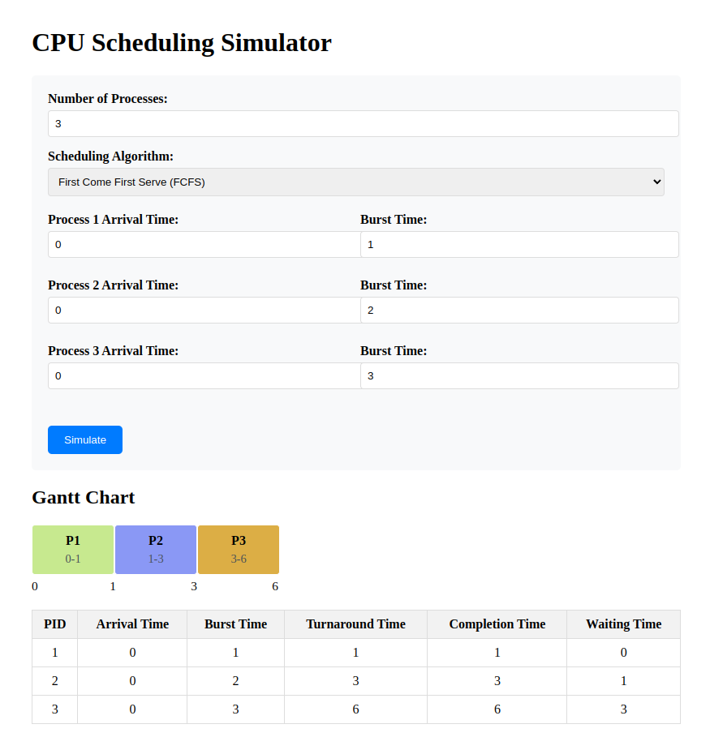
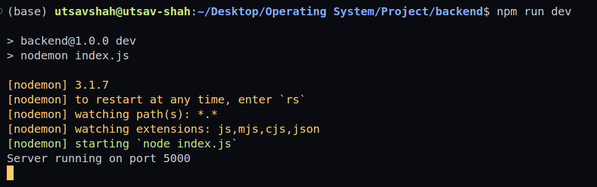
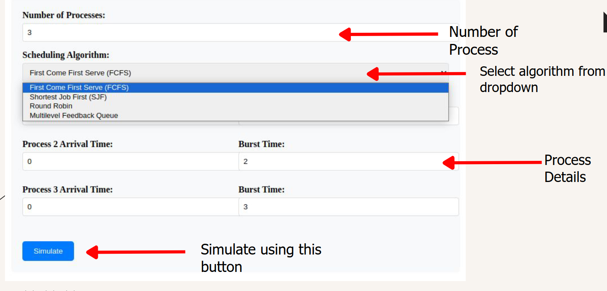
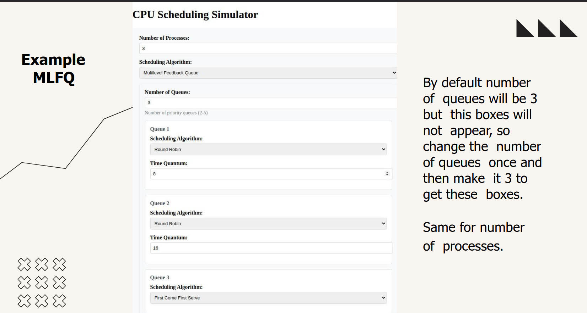

# CPU Scheduling Algorithms

This project demonstrates the implementation of various CPU scheduling algorithms, providing a backend server and a simple frontend interface for easy interaction and visualization.


---


## 🚀 Features

- Implementation of popular CPU scheduling algorithms (FCFS, SJF, RR, Multilevel Feedback Queue).
- Interactive visualization through a frontend.
- Modular backend server for computation and API endpoints.

---

## 📂 Project Structure

```
root/
├── backend/   # Node.js backend for algorithms and API
├── frontend/  # Frontend with an HTML interface
```

---

## 🛠️ How to Run

### 1. Clone the Repository

```bash
git clone https://github.com/your-username/cpu-scheduling-algorithms.git
cd cpu-scheduling-algorithms
```

### 2. Run the Backend Server

1. Navigate to the backend folder:
   ```bash
   cd backend
   ```
2. Install dependencies:
   ```bash
   npm install
   ```
3. Start the server:
   ```bash
   npm run dev
   ```
   The server will start running locally (default: `http://localhost:5000`).

### 3. Run the Frontend

1. Navigate to the `frontend` folder:
   ```bash
   cd ../frontend
   ```
2. Open the HTML file in any browser of your choice:
   - Directly double-click the HTML file.
   - **OR**, if using VS Code, right-click on the HTML file and select `Open with Live Server`.

---

## ⚙️ Prerequisites

Make sure you have the following installed on your system:
- [Node.js](https://nodejs.org/)
- Any modern browser (e.g., Chrome, Firefox)
- Optional: [Live Server Extension](https://marketplace.visualstudio.com/items?itemName=ritwickdey.LiveServer) for VS Code.

---

## 📷 Preview

### Backend Server Running


### Frontend Walkthrough


---

## Note
Please keep the following in mind: 


## 📚 Learn More

- [CPU Scheduling Algorithms](https://www.geeksforgeeks.org/cpu-scheduling-in-operating-systems/)
- [Node.js Documentation](https://nodejs.org/en/docs/)

---
